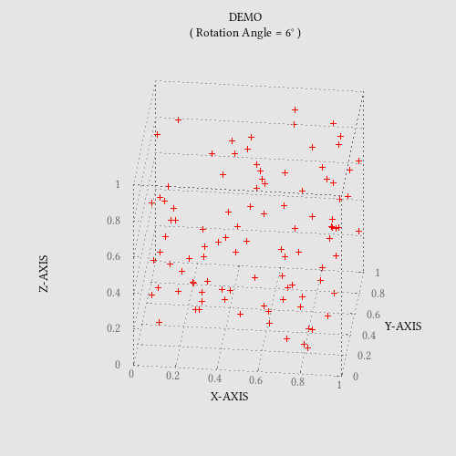

# scatter

Go package for creating an animated GIF of a rotating 3D scatter plot.



## Install

To install the package and its example:
```sh
go get -u github.com/ybeaudoin/go-scatter
```

The package imports binet's gnuplot package which can be installed as follows:
```sh
go get -u bitbucket.org/binet/go-gnuplot/pkg/gnuplot
```
It in turn requires that a gnuplot executable be installed and be findable via the environment path statement.
See http://www.gnuplot.info/download.html for available versions.

## At a glance

The package exports the following:

 * Type
   * `OptSet struct`  
     Plot options
 * Function:
   * `Plot(options OptSet, dataFile, gifFile string)`  
     Creates an animated GIF of a rotating 3D scatter plot.

## OptSet structure

| Field | Type | Description |
| --- | --- | --- |
|TITLE|string|centered plot title|
|XLABEL|string|x-axis label|
|YLABEL|string|y-axis label|
|ZLABEL|string|z-axis label (will be rotated 90 degrees)|
|XRANGE|string|x-axis range|
|YRANGE|string|y-axis range|
|ZRANGE|string|z-axis range|
|XYPLANE|float64|position at which the xy plane intersects the z-axis|
|COLUMNS|string|data columns to plot|
|BGCOLOR|string|background color specified as an hex string prefixed with the character "x"|
|PTCOLOR|string|data point color|
|PLOTDELAY|int|delay between the display of successive images in units of 1/100 second|
|PLOTROT|int|rotation angle between the display of successive images in degrees|
|PLOTHEIGHT|int|plot height in pixels|
|PLOTWIDTH|int|plot width in pixels|
|FONT|string|font name & comma-separated optional size|

## MIT License

Copyright (c) 2016 Yves Beaudoin webpraxis@gmail.com

See the file LICENSE for copying permission.


